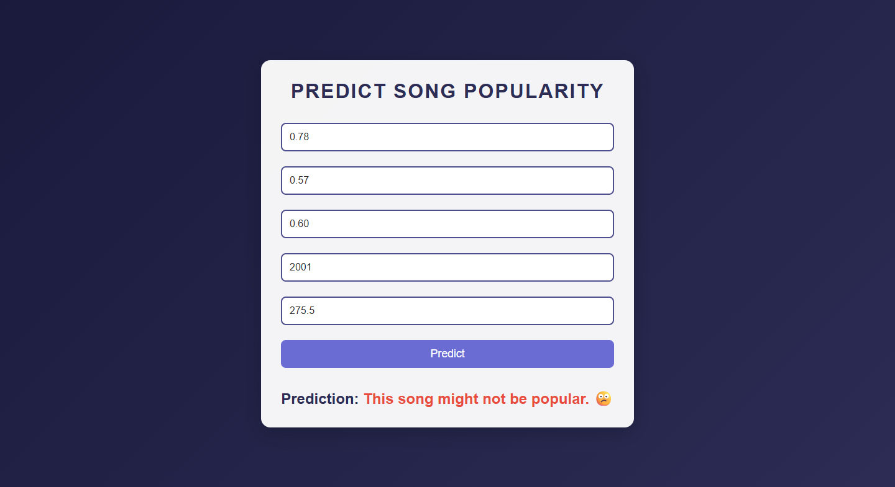

# Song Popularity Prediction Web App


A Flask-based web application to predict song popularity using a CatBoost machine learning model. Users can input five song features—`artist_familiarity`, `artist_hotttnesss`, `song_hotttnesss`, `year`, and `start_of_fade_out`—to determine if a song is likely to be popular.

## Table of Contents
- [Features](#features)
- [Screenshots](#screenshots)
- [Installation](#installation)
- [Usage](#usage)
- [File Structure](#file-structure)
- [Dependencies](#dependencies)
- [Model Details](#model-details)
- [Contributing](#contributing)
- [License](#license)

## Features
- Input form for five song features with default values for ease of use.
- Modern, responsive UI with a clean design and gradient background.
- Real-time prediction of song popularity (popular or not popular).
- Error handling for invalid inputs.
- CSRF protection disabled for development (not recommended for production).

## Screenshots

### Home Page



## Installation

1. **Clone the repository**:
   ```
   git clone https://github.com/your-username/song-popularity-prediction.git
   cd song-popularity-prediction
   ```

2. **Set up a virtual environment**
```
python -m venv venv
source venv/bin/activate  # On Windows: venv\Scripts\activate
```

3. **Install dependencies:**
```
pip install -r requirements.txt
```
- Ensure the model file:
    - Place the trained CatBoost model (cat_model.pkl) in the project root directory.

    - The model must be trained on the features: artist_familiarity, artist_hotttnesss, song_hotttnesss, year, start_of_fade_out.

### Usage

- **Run the application:**

```
python app.py

```

### File Structure 

```
song-popularity-prediction/
├── app.py                    # Main Flask application
├── cat_model.pkl             # Trained CatBoost model (not included in repo)
├── templates/
│   └── index.html            # HTML template for the web interface
├── static/
│   └── style.css             # CSS for styling the web interface
├── images/
│   ├── image.png            # Project banner image
│  
│   
│   
├── requirements.txt          # Python dependencies
└── README.md                 # Project documentation
```
### Dependencies
```
scikit-learn==1.2.2
numpy==1.26.4
catboost==1.2.8
flask
Flask-WTF
```

### Model Details
- Algorithm: CatBoost

- Features: 
    - artist_familiarity (0.0–1.0)

    - artist_hotttnesss (0.0–1.0)

    - song_hotttnesss (0.0–1.0)

    - year (e.g., 1969–2001)

    - start_of_fade_out (seconds)

- Output: Binary classification (0 = not popular, 1 = popular)

- Model File: cat_model.pkl (must be trained on the above features)

- Note: Ensure cat_model.pkl is compatible with the five input features. If you encounter a feature mismatch error, retrain the model using the same features.

